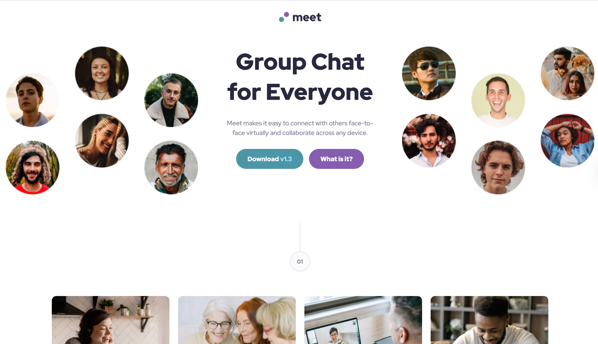
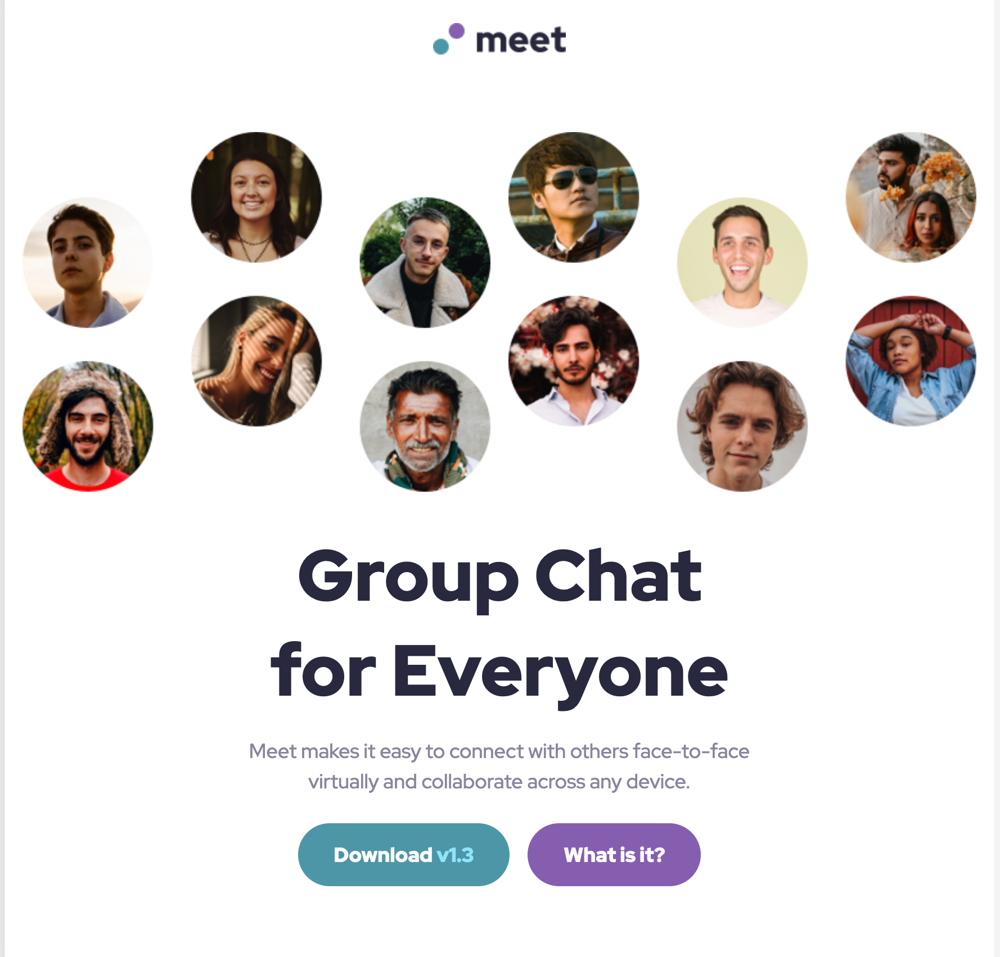
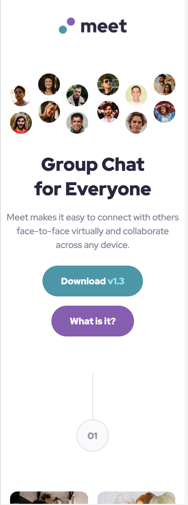

# Frontend Mentor - Meet landing page solution

This is a solution to the [Meet landing page challenge on Frontend Mentor](https://www.frontendmentor.io/challenges/meet-landing-page-rbTDS6OUR). Frontend Mentor challenges help you improve your coding skills by building realistic projects.

## Table of contents

- [Overview](#overview)
  - [The challenge](#the-challenge)
  - [Screenshot](#screenshot)
  - [Links](#links)
- [My process](#my-process)
  - [Built with](#built-with)
  - [What I learned](#what-i-learned)
- [Author](#author)

## Overview

### The challenge

Users should be able to:

- View the optimal layout depending on their device's screen size
- See hover states for interactive elements

### Screenshot

### Links

- Solution URL: (https://github.com/Tainicknackz/meet-landing-page)
- Live Site URL: (https://comforting-smakager-7d6f2f.netlify.app/)

## My process

### Built with

- Semantic HTML5 markup
- CSS custom properties
- CSS BEM NAMING
- CSS FLEX-BOX
- CSS Grid
- Mobile-first workflow

### What I learned

I learnt a lot about media queries and responsiveness.

## Author

- Frontend Mentor -(https://www.frontendmentor.io/profile/Tainicknackz)
